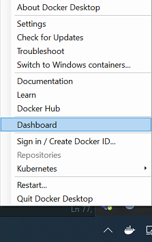
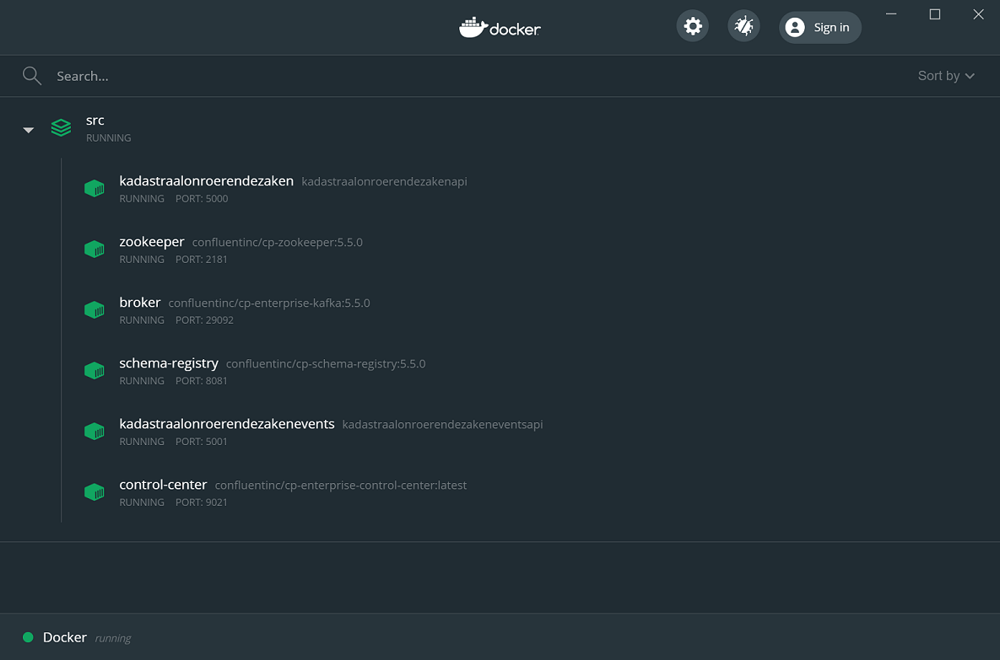

# BRK event sourcing POC

Voor de POC zijn twee volledig functionerende API's geïmplementeerd:

- [KadastraleOnroerendeZaken](https://raw.githubusercontent.com/VNG-Realisatie/Haal-Centraal-BRK-event-sourcing/master/poc/specificaties/KadastraalOnroerendeZaken/openapi.yaml) API. [swagger-ui](https://petstore.swagger.io/?url=https://raw.githubusercontent.com/VNG-Realisatie/Haal-Centraal-BRK-event-sourcing/master/poc/specificaties/KadastraalOnroerendeZaken/openapi.yaml) Met deze API kunnen Kadastrale Onroerende Zaken en Zakelijk Gerechtigden worden aangemaakt en gewijzigd. De bijbehorende state wijzigingen worden in een event sourcing store gepubliceerd.
- [KadastraleOnroerendeZakenEvents](https://raw.githubusercontent.com/VNG-Realisatie/Haal-Centraal-BRK-event-sourcing/master/poc/specificaties/KadastraalOnroerendeZakenEvents/openapi.yaml) API. [swagger-ui](https://petstore.swagger.io/?url=https://raw.githubusercontent.com/VNG-Realisatie/Haal-Centraal-BRK-event-sourcing/master/poc/specificaties/KadastraalOnroerendeZakenEvents/openapi.yaml) Met deze API kunnen de in de event sourcing store gepubliceerde state wijzigingen worden geconsumeerd.

De OAS specificaties van de API's zijn afgeleid van de [BRK-Bevragen](https://raw.githubusercontent.com/VNG-Realisatie/Haal-Centraal-BRK-bevragen/master/specificatie/BRK-Bevragen/genereervariant/openapi.yaml) en [BRK events bevragen](https://raw.githubusercontent.com/VNG-Realisatie/Haal-Centraal-BRK-event-sourcing/master/specificatie/genereervariant/openapi.yaml) API specificaties en zijn aangepast ten behoeve van de POC.

## Doel van de POC

Het doel van deze POC is om leveranciers van belasting applicaties te inspireren om de volgende event-driven patterns te implementeren:

- [Event Sourcing](https://martinfowler.com/eaaDev/EventSourcing.html).
- [Command Query Responsibility Seggregation (CQRS)](https://martinfowler.com/bliki/CQRS.html)

Het gaat om het gebruik van de event sourcing API en het geven van inzicht in de toepassing van de replay functionaliteit.

Voor de POC is gekozen om [Apache Kafka](https://kafka.apache.org/) als basis te gebruiken omdat in Apache Kafka een geavanceerd logging mechanisme is geïmplementeerd waarmee de Event Sourcing pattern makkelijk kan worden gedemonstreerd.

Messages worden sequentieel en duurzaam in de log geschreven waardoor consumers:

- de messages in de volgorde van schrijven kunnen uitlezen (nodig voor historie)
- onafhankelijk kan elkaar kunnen bepalen wanneer en met welke snelheid zij de log uitlezen. (nodig voor het realiseren van loose coupling van provider en consumers)
- vanaf elke gewenste positie in de log messages kunnen uitlezen (nodig voor replay)

Voor het BRK event sourcing project zijn een aantal requirements gespecificeerd die niet kunnen worden gerealiseerd door het sequentieel uitlezen van de log. Deze requirements gaan over het zoeken van messages op basis van data in de messages (identificatie van een kadastraal onroerende zaak, zakelijk gerechtigde of stuk, of kadastrale aanduiding). Om dit te realiseren wordt de CQRS pattern toegepast. In essentie komt het er in deze pattern op neer om voor het raadplegen van data een ander model (geoptimaliseerd voor query-en) te gebruiken dan die voor het beheren van de data (geoptimaliseerd voor updaten). Het is dan ook mogelijk om voor het query model een andere store (voor deze POC een sqlite database) te gebruiken. Bijkomend voordeel van deze scheiding is dat in de POC het replay-en van de log kan worden gedemonstreerd.

Hieronder wordt uitgelegd hoe de CQRS pattern is geïmplementeerd en hoe hiermee het replay-en van de log kan worden beproefd.

## Afbakening van de POC

De in de POC gebruikte technologie en code zeggen niets over een implementatie van de OAS specificatie bij en door het Kadaster.
De code gerealiseerd voor de POC is niet productie rijp. Er zijn geen business rules geïmplementeerd om de integriteit van een kadastraal onroerende zaak of zakelijk gerechtigde na wijzigingen te waarborgen. Ook zijn er geen unit testen geïmplementeerd om de werking van de code te valideren.

## Implementatie van de CQRS pattern

Zoals kort beschreven in de 'Doel van de POC' biedt een store geïmplementeerd volgens de Event Sourcing pattern geen functionaliteit om in de messages te zoeken. Een event sourcing store is geoptimaliseerd om sequentieel de opgeslagen messages uit te lezen.

Om het zoeken op basis van kadastraal onroerende zaak identificatie, zakelijk gerechtigde identificatie, stuk identificatie of kadastrale aanduiding mogelijk te maken is de CQRS pattern toegepast. In een aparte database wordt voor elke (kadastrale onroerende zaak, zakelijk gerechtigde of stuk) identificatie of kadastrale aanduiding bijgehouden wat de posities zijn van de messages die horen bij een identificatie of kadastrale aanduiding. Deze database wordt door een background proces van de API in sync gehouden met de message die worden gepubliceerd in de log.
Om het replay-en van de log te demonstreren, wordt deze database weggegooid als de API wordt gestopt. Wanneer de API weer wordt opgestart, is in de log te zien dat de background proces de log vanaf het begin uitleest om de database weer op te bouwen.

## Getting started

Er zijn 3 manieren om de API's gerealiseerd in de POC uit te proberen:

- In de cloud gehoste versie
- Lokaal in Docker met de in Docker Hub gepubliceerde Docker images
- Lokaal in Docker met lokaal gebouwde Docker images voor de API's

### Cloud gehoste versie

Deze wordt op dit moment gerealiseerd. Zodra dit mogelijk is, zal informatie hierover worden gepubliceerd.

### Lokaal in Docker met in Docker Hub gepubliceerde images

Zodra dit mogelijk is, wordt informatie hierover gepubliceerd.

### Lokaal in Docker Desktop met lokaal gebouwde Docker images voor de API's

Hiervoor moet de volgende software lokaal worden geïnstalleerd:

- [Docker Desktop](https://docs.docker.com/get-docker/)
- [.NET Core SDK](https://dotnet.microsoft.com/download)

De volgende stappen moeten in een command prompt worden uitgevoerd:

- Clone de Haal-Centraal-BRK-event-sourcing repo  
  `git clone https://github.com/VNG-Realisatie/Haal-Centraal-BRK-event-sourcing.git`
- navigeer naar de src map  
  `cd Haal-Centraal-BRK-event-sourcing\poc\src`
- Bouw de benodigde Docker images. Dit kan de eerst keer enige tijd duren  
  `docker-compose build`
- Start de Docker containers  
  `docker-compose up -d`

Met behulp van de Docker Dashboard (op te starten via Docker's context menu) is dan een overzicht van de opgestarte containers.

De 'Kadastraal Onroerende Zaken API' en de 'Kadastraal Onroerende Zaken Events API' kunnen nu worden benaderd via respectievelijk 'http://localhost:5000' en 'http://localhost:5001'

De Docker containers kunnen worden gestopt door het uitvoeren van de volgende statement:  
`docker-compose down`
